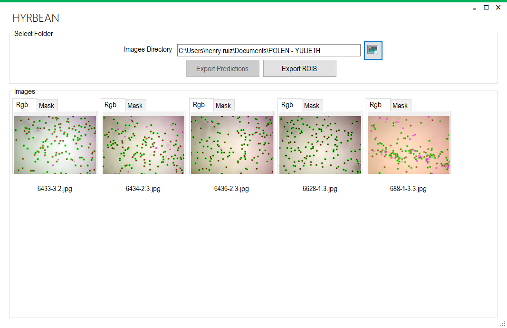

# HYRBEAN
After a satisfactory pollen grain staining, pollen viability is usually evaluated by the quantification of the number of viable and non-viable grains on the microscope samples. Although the manual counting and classification of the grains is the most straightforward and sensitive approach, it is laborious, time-consuming, and biased by the visual capacity of the expert. So, HYRBEAN is an open-source software implemented for the high-throughput phenotyping of pollen viability, which uses machine learning and image processing techniques to count and classify the pollen grains in the photos collected by a 2d camera attached to the microscope. The model was trained with around 2000 images by class and is capable of distinguishing between viable pollen and non-viable pollen with a Pearson correlation of   0.98 and 0.96, respectively.

Research Article: [Physiological and genetic characterization of heat stress effects in a common bean RIL population](https://journals.plos.org/plosone/article?id=10.1371/journal.pone.0249859)

